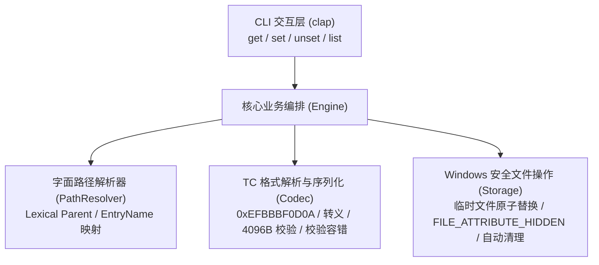

# Dion 设计规约 (Design Specification)

本文档定义了 Dion 命令行工具的架构设计、数据存储规范、CLI 交互协议及实现准则。

---

## 1. 项目定位与核心原则

- **项目定位**：轻量、高性能、零运行依赖的 Windows 原生 CLI 工具，专门用于查看、编辑与维护符合 Total Commander 标准的 UTF-8 `descript.ion` 文件备注。
- **KISS 原则 (Keep It Simple, Stupid)**：核心逻辑纯粹，拒绝过度设计与模糊推断；仅认真实换行作为行切分，不引入复杂的转义语法树。
- **第一性原理 (First Principles)**：
  - 文件自身的备注不保存在自身，而保存在其直接父目录（Parent Directory）下的 `descript.ion` 中。
  - 文件的物理存储位置与备注的组织关系解耦为 `(ParentDirectory, EntryName)`，通过字面层级推导（Lexical Resolution）定位，不追踪符号链接与 Junction 目标。
  - Windows 原生大小写不敏感匹配，保证一个文件在备注清单中至多存在一条记录。
- **Agent 与脚本友好 (Agent & Automation Friendly)**：
  - 提供标准输入（Stdin）通道，通过管道无损传输复杂长文本，彻底消除外层 Shell 引号转义隐患。
  - 规范严格的四级退出码体系（0: 成功/幂等完成, 1: 未找到, 2: 参数用法错误, 3: 格式或 I/O 错误）。
  - 输出格式高度确定：默认纯净文本输出，`get` 与 `list` 均原生支持 `--json`。

---

## 2. 技术栈与工程架构

### 2.1 技术选型与交付目标
- **开发语言**：Rust (2021 Edition)
- **编译目标**：`x86_64-pc-windows-msvc`，配置 `+crt-static`（静态链接 C 运行时），无需额外安装 VC++ Redistributable。
- **交付形态**：独立单二进制文件 `dion.exe`（Release 构建启用 LTO 与 Strip，体积 ≤ 2MB）。
- **性能指标**：基于 Rust 零成本抽象，冷启动 < 5ms，典型目录读写耗时 < 10ms。

### 2.2 核心模块架构



---

## 3. Total Commander descript.ion 格式规范 (UTF-8)

Dion 严格遵守并仅支持 Total Commander 的 UTF-8 编码规范（参见 [ADR-0001](file:///d:/Workspace/code/dion/docs/adr/0001-utf8-only-encoding.md)）：

### 3.1 文件头 (Header)
- 文件的起始 5 个字节必须为：`0xEF 0xBB 0xBF 0x0D 0x0A`（UTF-8 BOM 紧随 CRLF 回车换行符）。
- 若目标目录已有的 `descript.ion` 不包含此合法头部（如为旧版 ANSI、UTF-16 LE 等），Dion **拒绝读取与写入并返回错误（退出码 3）**，防止破坏非 UTF-8 文件。

### 3.2 条目格式 (Entry Structure)
每一行记录一个文件或文件夹的备注，以 `0x0D 0x0A`（CRLF）结尾。整行由四个部分组成：
1. **Entry Name**：单层文件名或目录名。
   - 若名称中**包含空格**，必须由英文双引号包围（例如 `"父文件夹1 - 副本"`）。
   - 若名称中**不含空格**，不得添加双引号（例如 `config.json`）。
2. **分隔空格**：单个 ASCII 空格字符（`0x20`）。
3. **备注正文 (Comment Payload)**：支持单行备注与多行备注。
4. **行尾符**：CRLF（`0x0D 0x0A`）。

### 3.3 备注正文编码与转义规则
根据 TC 格式规范的分层定义：
- **单行备注**：
  - 纯粹的备注信息，原样记录文本，末尾接 CRLF。
  - 单行备注**不附加** `0x04C382` 结束标记，反斜杠字符 `\` 保持原样不转义。
- **多行备注**：
  - 行间分隔符：使用字符序列 `\n`（即 `0x5C 0x6E`，非普通换行控制符）。
  - 反斜杠转义：正文中的所有真实 `\` 转义为 `\\`（`0x5C 0x5C`）。
  - 结束标记：多行备注的最后一行正文末尾紧接 `0x04 0xC3 0x82`（`0x04` 为 4NT 结束符，`0xC3 0x82` 为 TC 向 JP Software 申请的应用签名）。
- **解码逻辑**：
  - 若行末包含 `0x04 0xC3 0x82`，判定为多行备注：剥离该标记，并通过一次性扫描将 `\\` 还原为 `\`、将 `\n` 还原为系统真实换行符。
  - 若行末不包含该标记，判定为单行备注：原样输出文本。
- **单行长度上限**：
  - 每一行（从 Entry Name 到 CRLF 结束）的最大物理字节限制为 **4096 字节**。
  - 写入前计算整行 UTF-8 编码后的物理字节长度，若超出 4096 字节立即拒绝写入并报错（退出码 3）。

### 3.4 损坏数据保护 (Fail-Safe on Malformed Data)
遵循 [ADR-0007](file:///d:/Workspace/code/dion/docs/adr/0007-fail-safe-on-malformed-data.md)：
- 若已有 `descript.ion` 文件存在非法 UTF-8 字节、损坏的引号闭合、或存在大小写重复的冲突条目，`set` 和 `unset` 立即拒绝写入并报错退出（退出码 3），给出具体行号与原因，杜绝静默破坏用户现有数据。

---

## 4. 文件系统与生命周期语义

### 4.1 字面路径映射 (Lexical Path Resolution)
对任意给定的目标路径 `TARGET`：
1. 采用字面推导（Lexical Normalization）消除 `.` 与 `..`，不解析符号链接与 Junction 到其物理目标，确保备注始终记录在用户操作目录项的直接父目录中。
2. 剥离直接父目录 `Parent(TARGET)` 与当前节点名 `EntryName`。
3. 目标物理备注文件锁定为 `Parent(TARGET)\descript.ion`。
4. 不要求目标文件在物理文件系统中必须存在（支持预写备注或维护孤立备注）。
5. 比较 `EntryName` 时，采用 Windows 原生字符规则（不区分大小写），防止产生大小写冗余条目。

### 4.2 安全原子替换 (Atomic Replacement)
遵循 [ADR-0002](file:///d:/Workspace/code/dion/docs/adr/0002-atomic-write-and-hidden-attribute.md)：
1. 写入时在同目录下创建临时文件（如 `descript.ion.<pid>_<timestamp>.tmp`）。
2. 在临时文件创建时立即设置 `FILE_ATTRIBUTE_HIDDEN` 属性。
3. 写入 Header `0xEFBBBF0D0A` 与各条目数据，调用操作系统刷新缓冲（`FlushFileBuffers`）。
4. 关闭文件句柄后，使用 Windows 原生 `ReplaceFileW`（或在目标不存在时使用 `MoveFileExW`）原子覆盖目标 `descript.ion`，杜绝进程崩溃导致的半写破损。
5. 编辑器交互模式（`-e`）：在用户编辑期间绝对不占用任何文件句柄或写锁；在编辑器关闭并成功保存后，重新读取最新文件并合并写入。

### 4.3 自动清理与空文件策略
- 若执行删除或清空条目后，该 `descript.ion` 中不再包含任何有效备注记录，Dion 将直接删除该 `descript.ion` 文件，保持用户文件系统的整洁，不残留空隐藏文件。

### 4.4 行序保持 (Order Preservation)
- 遵循 [ADR-0005](file:///d:/Workspace/code/dion/docs/adr/0005-idempotent-unset-and-order-preservation.md)：
- 对已有条目的更新保持其在文件中的原有行顺序。
- 新增条目追加至文件末尾。

---

## 5. CLI 命令接口规约

### 5.1 统一退出码规范

| 退出码 | 状态分类 | 触发场景 |
| :---: | :--- | :--- |
| **`0`** | 成功 / 幂等完成 | 命令成功执行；`unset` 目标无备注时幂等成功；`list` 目录无备注条目。 |
| **`1`** | 未找到 (Not Found) | 仅在 `dion get` 查询的目标文件不存在备注（或对应 `descript.ion` 不存在）时返回。 |
| **`2`** | 用法错误 (Usage Error) | 命令行参数解析失败、输入源冲突、未指定输入源（遵从 `clap` 惯例）。 |
| **`3`** | 执行错误 (Operation Error) | I/O 错误、权限不足、文件损坏、非 UTF-8 编码、单行超出 4096 字节等。 |

---

### 5.2 命令一览

| 主命令 | 别名 | 功能说明 | 适用选项 |
| :--- | :--- | :--- | :--- |
| `dion get <PATH>` | `view`, `cat` | 查看指定文件/目录的备注 | `--raw`, `--json`, `-q/--quiet` |
| `dion set <PATH> [COMMENT]` | - | 设置或更新备注（三选一互斥输入源） | `--stdin`, `-`, `-e/--edit` |
| `dion unset <PATH>` | `rm`, `del` | 删除指定文件/目录的备注（幂等设计） | - |
| `dion list [DIR]` | `ls` | 列出指定目录（或递归子目录）的所有备注条目 | `-r/--recursive`, `--json` |

---

### 5.3 `dion get` (读取备注)

```text
用法: dion get <TARGET_PATH> [选项]
别名: view, cat

参数:
  <TARGET_PATH>    目标文件或目录路径

选项:
  --raw            输出未解码的物理存储格式（包含字面量 \n 与应用结束标记）
  --json           以 JSON 对象格式输出 ({"path": "...", "name": "...", "comment": "..."})
  -q, --quiet      静默模式，当未找到备注时不向 stderr 打印提示信息
  -h, --help       打印帮助信息
```

- **行为规范**：
  - **命中条目**：
    - 默认模式：向 stdout 打印 Display Comment 并追加换行，退出码为 `0`。
    - `--raw` 模式：向 stdout 打印未解码的物理字符串。
    - `--json` 模式：输出 JSON 对象，`comment` 字段包含完整的解码文本。
  - **未命中条目**：stdout 无输出；向 stderr 打印未找到信息（若指定 `-q` 则静默），退出码为 `1`。

---

### 5.4 `dion set` (设置与编辑备注)

```text
用法: dion set <TARGET_PATH> [COMMENT] [选项]

参数:
  <TARGET_PATH>    目标文件或目录路径
  [COMMENT]        备注文本内容（可传单个字符 "-" 表示从 stdin 读取）

选项:
  -e, --edit       在终端交互式调起外部文本编辑器进行编辑
  --stdin          从标准输入 (stdin) 读取备注文本
  -h, --help       打印帮助信息
```

- **行为规范**：
  - **输入源三选一（严格互斥）**：
    1. 位置参数：`dion set <PATH> "内容"`
    2. 标准输入：`dion set <PATH> -` 或 `dion set <PATH> --stdin`
    3. 交互式编辑器：`dion set <PATH> -e`
    - 若三者均未指定，或同时指定了多个，立即报错退出（退出码 `2`）。
  - **交互式编辑器机制**：
    - 若处于非 TTY 环境（无交互终端），立即报错拒绝（退出码 `2`）。
    - 编辑器查找顺序：环境变量 `$VISUAL` -> `$EDITOR` -> `notepad.exe`。
    - 交互前生成临时编辑文件，不锁定目标 `descript.ion`；编辑结束后读取内容并安全合并写入。
  - **空白与清空语义**：
    - 传入 0 字节内容或仅包含空白字符（空格/制表符/换行），**自动等价于调用 `unset`**，清除条目。
    - 非空白内容严格保留用户输入的首尾空白与换行格式，禁止随意裁切。
  - **换行规则**：遵循 [ADR-0003](file:///d:/Workspace/code/dion/docs/adr/0003-literal-newlines-only.md)，仅真实换行符（CRLF/LF）作为行间分隔，字面量 `\n` 视为普通文本。

---

### 5.5 `dion unset` (删除备注)

```text
用法: dion unset <TARGET_PATH> [选项]
别名: rm, del

参数:
  <TARGET_PATH>    目标文件或目录路径

选项:
  -h, --help       打印帮助信息
```

- **行为规范**：
  - 幂等性（参见 [ADR-0005](file:///d:/Workspace/code/dion/docs/adr/0005-idempotent-unset-and-order-preservation.md)）：若目标条目原本不存在，视为操作完成，返回退出码 `0`。若发生 I/O 或权限错误，返回退出码 `3`。
  - 若删除后文件无剩余条目，自动删除物理 `descript.ion` 文件。

---

### 5.6 `dion list` (列出备注)

```text
用法: dion list [DIR] [选项]
别名: ls

参数:
  [DIR]            目标目录（默认为当前工作目录 "."）

选项:
  -r, --recursive  递归扫描所有子目录下的 descript.ion 文件（不跨越符号链接/Junction）
  --json           以 JSON 数组格式输出
  -h, --help       打印帮助信息
```

- **路径展示**：
  - 单目录模式：路径展示为 Entry Name。
  - 递归模式 (`-r`)：路径展示为相对于指定的扫描根目录的相对路径（例如 `sub\file.txt`）。
- **输出格式**：
  - **终端人类可读模式**：对齐的两列（`PATH` 与 `COMMENT`）。
  - **JSON 模式 (`--json`)**：标准 JSON 数组，每个对象包含 `path`、`name`、`comment`。

---

## 6. 验证与测试策略

利用已有的 `.scratch/fixtures/` 测试夹具建立完整的集成与单元测试套件：
1. **UTF-8 编解码正确性验证**：针对 `.scratch/fixtures/父文件夹1 - 副本/descript.ion` 中包含的极端特殊字符、反斜杠、多行与 Unicode 字符进行 Round-trip 无损校验。
2. **大小写不敏感匹配验证**：混合大小写的文件名读写覆盖验证。
3. **原子性与属性验证**：验证在修改后文件属性仍具备 `FILE_ATTRIBUTE_HIDDEN`。
4. **空条目清理验证**：连续删除所有条目，验证 `descript.ion` 是否被整洁移除。
5. **损坏保护验证**：构造畸形与超长（>4096B）文件，验证是否以退出码 3 安全报错拒绝。
